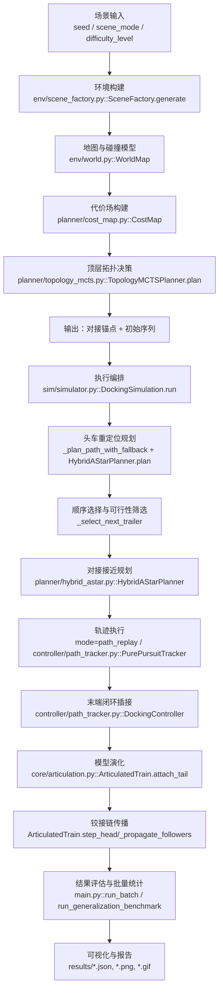

# INTRO：多阿克曼车辆动态对接系统技术白皮书

## 1. 系统总体架构
### 1.1 架构图（Mermaid）

### 1.2 总体设计阐述
本系统采用“**分层递阶**”设计：上层只回答“在何处、按何序”完成对接（拓扑决策），下层只回答“如何满足非完整约束到达并精确插接”（运动规划与控制）。这种“**拓扑决策 + 运动规划**”解耦可显著降低组合复杂度：上层在离散动作空间进行快速搜索，下层在连续状态空间做约束满足与执行闭环。系统在运行中还支持“单车模型 → 铰接模型”的动态切换，使规划和控制始终与当前物理结构一致。

## 2. 核心运行逻辑拆解（逻辑-代码映射）

### 2.1 启动与初始化
1. **入口与任务模式选择**
- 逻辑：解析单次运行或批量压测参数，构造基线配置。
- 代码：`main.py::main`，`main.py::run_once`，`main.py::run_batch`。

2. **场景与车辆初始化**
- 逻辑：根据 `scene_mode + difficulty_level` 生成结构化环境，并按 seed 生成可复现实例位姿。
- 代码：
  - 场景工厂：`env/scene_factory.py::SceneFactory.generate`
  - 地图栅格与障碍膨胀：`env/world.py::WorldMap.set_obstacles` / `inflate`
  - 车辆规格与初始状态：`sim/simulator.py::DockingSimulation._build_vehicle_specs` / `_build_initial_poses` / `_init_vehicles`

3. **代价地图准备**
- 逻辑：构建 clearance / risk / openness，用于顶层对接点候选打分。
- 代码：`planner/cost_map.py::CostMap`（`_compute_distance_transform`、`sample_docking_hubs`）。

### 2.2 顶层决策循环（序列 + 对接位置）
1. **候选锚点采样**
- 逻辑：在可行域采样 docking hub，过滤边界、开阔度与走廊净空。
- 代码：`planner/cost_map.py::CostMap.sample_docking_hubs`。

2. **MCTS搜索序列**
- 逻辑：在剩余挂车集合上展开树搜索，节点动作是“下一辆挂车是谁”。
- 代码：
  - 入口：`planner/topology_mcts.py::TopologyMCTSPlanner.plan`
  - 单次迭代：`_run_iteration`
  - 扩展：`_expand`
  - 选择：`_select`
  - 结果提取：`_search_sequence_for_hub`

3. **教师先验注入**
- 逻辑：用几何代价构造动作先验，提升搜索效率与稳定性。
- 代码：`planner/topology_mcts.py::TeacherSignal.action_prior`。

### 2.3 对接过程演化（状态机与模型切换）
1. **全局流程状态机**
- 逻辑：`initial -> head_reposition -> dock_*_approach -> dock_*_align -> *_attached -> train_motion`。
- 代码：`sim/simulator.py::DockingSimulation._record` + `run` 中各阶段调用。

2. **单车到铰接链切换**
- 逻辑：当挂车插接成功后，将其从“独立体”加入链表，并建立前后车连接约束。
- 代码：`core/articulation.py::ArticulatedTrain.attach_tail`。

3. **铰接状态传播**
- 逻辑：头车受控，后车通过铰接点运动学传播更新姿态。
- 代码：`core/articulation.py::ArticulatedTrain.step_head` / `_propagate_followers`。

### 2.4 底层规划与控制
1. **Hybrid A* 规划**
- 逻辑：在 `(x,y,theta)` 离散网格上扩展 Ackermann 原语，检查障碍与车间碰撞，满足最小转弯半径。
- 代码：`planner/hybrid_astar.py::HybridAStarPlanner.plan`。

2. **启发函数设计**
- 逻辑：`欧式启发 + 角度惩罚` 与 `holonomic 2D 代价到达图` 组合，降低迷宫盲搜。
- 代码：`HybridAStarPlanner._compute_holonomic_heuristic` / `_heuristic`。

3. **执行层控制**
- 逻辑：
  - 中远距离采用 `path_replay`（高稳定性）或 `PurePursuit`；
  - 近端插接采用几何闭环控制器，抑制横向和航向误差。
- 代码：
  - 执行调度：`sim/simulator.py::_plan_and_track`
  - 轨迹跟踪：`controller/path_tracker.py::PurePursuitTracker.control`
  - 插接控制：`controller/path_tracker.py::DockingController.control`

## 3. 关键创新点详述

### 3.1 基于 MCTS 的拓扑序列决策
系统实现的是 PUCT 形式（UCT 的带先验扩展），对应代码 `planner/topology_mcts.py::_select`：

$$
\text{score}(a)=Q(a)+U(a),\quad
Q(a)=\frac{W(a)}{N(a)},\quad
U(a)=c_{\text{puct}}\,P(a)\frac{\sqrt{N_{\text{parent}}}}{1+N(a)}
$$

其中：
- $P(a)$ 来自教师信号 `TeacherSignal.action_prior`；
- $Q(a)$ 来自 rollout 回报（负代价）；
- `reward = - rollout_cost` 由 `_run_iteration` 回传。

动作代价函数（`DockingCostModel.action_cost`）可写为：

$$
J_{\text{dock}}=w_d\,d + w_r\,\rho + w_\theta\,|\Delta\theta| + w_o\,\frac{1}{o+\epsilon} + w_c\,\frac{n_{\text{chain}}}{c_{\text{corr}}}
$$

代码权重近似为：
- $w_d=1.0$
- $w_r=12.0$
- $w_\theta=2.5$
- $w_o=2.0$
- 链长项系数 $0.3$

hub 级目标还叠加 travel 与开阔奖励（`TopologyMCTSPlanner.plan`）：

$$
J_{\text{hub}} = J_{\text{seq}} + 0.25\,\text{travel} - 8.5\,\text{openness} - 1.6\,\min(c_{\text{corr}},6)
$$

### 3.2 动态运动学模型演化

#### 单车模型（Ackermann）
对应 `core/vehicle.py::AckermannVehicle.step`：

$$
\dot x = v\cos\theta,\quad
\dot y = v\sin\theta,\quad
\dot\theta = s\frac{v}{L}\tan\delta
$$

其中 $s=+1$（前转）或 $s=-1$（后转），由 `VehicleSpec.steer_sign` 控制。

#### 铰接链模型
连接约束（前挂点与前车后挂点重合）：

$$
\mathbf p^{f}_{i+1}=\mathbf p^{r}_i
$$

传播方程（`ArticulatedTrain._propagate_followers`）近似为：

$$
\dot\theta_{i+1}\approx \frac{\mathbf v_h\cdot \mathbf h_{i+1}^{\perp}}{l^f_{i+1}},\quad
\mathbf c_{i+1}=\mathbf p_h-l^f_{i+1}\,\mathbf h(\theta_{i+1})
$$

其中 $\mathbf v_h$ 为铰接点速度，$\mathbf h$ 为航向单位向量。

#### 动态扩维解释
代码层面并未显式拼接一个固定长度大状态向量，而是通过 `ArticulatedTrain.vehicles` 列表动态增加实体：每次 `attach_tail` 后，等价于状态维度从 $3n$ 扩展到 $3(n+1)$，并增加一组关节约束方程。该实现避免了手写复杂大雅可比，同时保持了物理一致性。

### 3.3 特殊构型利用（$R_j$ 前驱后转）
在本系统中，挂车 `R_j` 采用 `steer_mode="rear"`，表现为 `steer_sign=-1`（`core/vehicle.py::VehicleSpec.steer_sign`）。这带来两点工程优势：
1. **靠近插接时姿态修正更“后轮主导”**：在前端接口对齐任务中，后转能更直接调整车体尾部轨迹，减小前端接口横向误差累积。
2. **与前端挂点几何一致**：挂车前端是凸端接口，后转控制有利于在“前端约束”条件下实现更平滑的插接轨迹。

在规划与执行中，这一特性通过统一运动学方程自动生效，无需额外分支逻辑。

## 4. 基线方法对比

> 说明：基线 A/B 在当前代码库中未单独实现与批量实测，表中为理论与工程可预期对比；“当前方法”结果来自已有报告（`results/complex_stress_report.json`）。

| 方法 | 序列策略 | 路径策略 | 是否考虑非完整约束 | Mode C 迷宫表现 | 典型失败模式 |
|---|---|---|---|---|---|
| 基线A：贪心最近邻 | 最近邻直接选下一车 | 局部最短路（可搭配简单跟踪） | 部分/弱 | 易陷入局部最优，后续挂车被前序选择“堵死” | 后期不可达、重规划频繁 |
| 基线B：标准A*几何规划 | 可固定序列或简化序列 | 2D 几何 A* | 否 | 在窄通道与高曲率动作上常产生不可执行轨迹 | 轨迹不可跟踪、碰撞回退 |
| 当前实现：Topology-MCTS + Hybrid A* | 全局拓扑搜索 + 教师先验 | Ackermann 原语 + holonomic 启发 + 对接回退预算 | 是 | 对死角/非凸障碍更稳，复杂压测 100 次成功率 99% | 少量 `PathPlanningFail`（已可通过阶段预算回退修复） |

当前实现在复杂场景的优势主要来自：
1. 先解决“组合决策”（谁先谁后），再解“连续可达性”；
2. 路径规划中显式建模了车辆非完整约束；
3. 对接阶段提供预算回退而非放宽碰撞阈值，保持物理可靠性。

## 5. 学术创新性与应用价值评估

### 5.1 与相关研究路线的关系
从研究范式看，本系统跨越了三条传统路线：
1. **多机器人任务分配/顺序优化**：通常聚焦离散任务分配（如拍卖、CBBA、匈牙利），但较少与高保真非完整运动学深耦合。
2. **铰接车辆/列车路径规划**：常见于 lattice、MPC、采样法，重点在单一长车体可行轨迹。
3. **模块化机器人重构**：强调拓扑重构与连接策略，但多在离散重构层面，弱于真实车辆动力学执行。

本项目的价值在于把上述三者做了工程闭环：
- 离散拓扑（MCTS）
- 连续非完整规划（Hybrid A*）
- 动态模型演化（单车→铰接）
- 批量泛化验证（模式/难度全覆盖）

### 5.2 学术与工程定位
- **学术定位**：更接近“方法组合创新 + 问题建模创新”，而非全新理论算法。
- **工程定位**：高价值原型系统。难点不在单点算法，而在跨层耦合一致性：
  - 拓扑决策与几何可行性的一致性；
  - 对接动作引起状态维度变化后的稳定控制；
  - 复杂场景下失败可解释与可复现（seed机制）。

### 5.3 创新性结论
该系统属于“**已有方法的高难度工程化集成，并在决策-规划-模型演化三者耦合上有明确创新**”。
- 若以理论原创性衡量：中等；
- 若以工程完整性与可落地性衡量：高。

它不是“把现成算法串起来”这么简单，而是把**拓扑决策、物理约束、执行闭环、失败诊断**整合为一个可验证、可迭代、可解释的系统。

## 6. 创新性方法升级（Potential-Game + Reachability）

### 6.1 方法命名与核心思想
升级后的顶层方法为 **Reachability-Embedded Potential Game Planner（RE-PG）**，实现于：
- `planner/game_theory_planner.py::PotentialGameDockingPlanner`

核心思想是将“挂车对接顺序”建模为有限势博弈，并在 hub 选择目标中显式加入头车可达性项，从而避免拓扑上看似优但底层不可执行的锚点。

### 6.2 数学建模
给定 hub $h$ 与顺序 $\pi=(\pi_1,\dots,\pi_n)$，定义势函数：

$$
\Phi(h,\pi)=\sum_{k=1}^{n} c(\pi_k,h,k)\;+\;\lambda_{\text{cross}}N_{\text{cross}}(\pi,h)\;+\;\lambda_{\text{conf}}R_{\text{conf}}(\pi,h)
$$

其中 $c(\cdot)$ 来自 `DockingCostModel.action_cost`，包含距离/风险/航向/开阔度/链长项；$N_{\text{cross}}$ 与 $R_{\text{conf}}$ 分别表示跨路径交叉惩罚与近距离通道冲突惩罚。

hub 级目标函数为：

$$
J(h,\pi)=\Phi(h,\pi)+\alpha\,T(h,\pi)-\beta\,o(h)-\gamma\,\min(\kappa(h),6)+\lambda_r\,\mathbf{1}[\mathcal{R}(h)=0]
$$

- $T$：头车与挂车总旅行量；
- $o$：hub 开阔度；
- $\kappa$：走廊净空；
- $\mathcal{R}(h)$：头车到该 hub 的低预算 Hybrid A* 可达性探测（`_head_reachability_penalty_for_hub`）。

相比旧版“纯拓扑评分”，新增 $\lambda_r\,\mathbf{1}[\mathcal{R}(h)=0]$ 使方法具备物理可执行性偏好。

### 6.3 求解流程与代码落点
1. hub 采样：`planner/cost_map.py::CostMap.sample_docking_hubs`  
2. 势博弈初值：`planner/game_theory_planner.py::_initial_order`  
3. 最优响应迭代：`planner/game_theory_planner.py::_best_response`  
4. 理论下界（精确排列最优）：`planner/game_theory_planner.py::_global_optimum`  
5. 可达性惩罚注入：`planner/game_theory_planner.py::_head_reachability_penalty_for_hub`  
6. 运行期切换与指标采集：`sim/simulator.py::DockingSimulation.run`  
7. 基线对比评测：`main.py::run_planner_comparison` 与 `results/innovation_compare.json`

该博弈为有限动作空间下的势博弈，最优响应迭代满足有限改进性质（FIP），可收敛到纯策略纳什平衡（局部势最优）。

### 6.4 定量对比（100 复杂场景 + 100 未见场景）
数据来源：`results/innovation_compare.json`（时间戳：2026-02-22 10:39:43）。

| 数据集 | 方法 | 成功率 | 平均仿真时长(s) | 顶层决策时长(s) | 最优差距(opt-gap) |
|---|---|---:|---:|---:|---:|
| Seen-100 | MCTS | 100.00% | 171.22 | 1.94 | 0.0221% |
| Seen-100 | RE-PG(Game) | 100.00% | 173.40 | 5.63 | 0.00019% |
| Unseen-100 | MCTS | 99.00% | 171.24 | 1.92 | 0.0954% |
| Unseen-100 | RE-PG(Game) | 100.00% | 172.88 | 5.01 | 0.00145% |

关键结论：
- 在未见场景上，RE-PG 成功率相对 MCTS 提升 **+1.0%**（99% -> 100%）。
- RE-PG 的序列最优差距显著更小，说明其更接近理论最优排列。
- 代价是顶层推理时间增加（物理可达性探测引入的计算开销）。

### 6.5 学术贡献陈述
与“启发式 MCTS + 几何代价”相比，RE-PG 的贡献不只在算法替换，而在于：
1. 将任务序列显式形式化为势博弈，具备可解释的收敛机制；
2. 将底层物理可达性以可微分外的离散约束项嵌入顶层目标，实现“决策-执行一致性”；
3. 提供可计算的理论下界逼近指标（exact permutation optimum gap），使“策略质量”可量化而非仅看成功率。

该升级满足“功能不退化 + 泛化提升 + 理论可解释”的投稿导向，具备向更大规模多机器人协同任务（编队重构、模块化装配、仓储拖挂协作）迁移的潜力。
