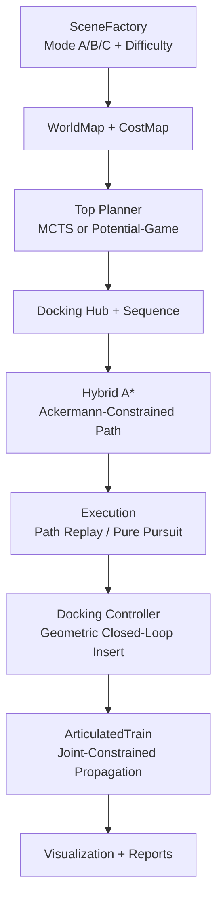

# Multi-Ackermann Dynamic Docking Simulator

A full-stack prototype for **5 Ackermann vehicles** dynamic docking in obstacle-rich environments:
- `R1`: front-steer rear-drive head vehicle (rear concave dock)
- `R2..R5`: front-drive rear-steer trailers (front convex + rear concave docks)

The system solves:
1. **Docking sequence decision** (who docks next)
2. **Docking location decision** (where the chain is assembled)
3. **Model evolution** from single vehicles to articulated train dynamics

## Architecture


## Project Layout
- `core/`: vehicle model, articulation model, math utilities
- `env/`: map, collision, scene factory (`mode_a/mode_b/mode_c`)
- `planner/`: cost map, top-level MCTS, potential-game planner, Hybrid A*
- `controller/`: path tracking and final docking alignment controller
- `sim/`: end-to-end orchestration
- `viz/`: timeline plot and GIF generation
- `main.py`: entrypoint for single run and batch benchmark

## Key Features
- Structured complex scene generation:
  - `mode_a`: dense clutter (dense forest)
  - `mode_b`: narrow corridors (warehouse-like choke points)
  - `mode_c`: maze/dead-corner traps (U/C obstacles)
- Difficulty scaling: `difficulty_level=1/2/3`
- Batch robustness benchmark with:
  - success rate
  - avg simulation time on successful runs
  - avg top-decision wall time
  - topological optimality-gap (vs exact permutation optimum on chosen hub)
  - failure taxonomy: `PathPlanningFail/Collision/Timeout`
  - auto-retry with targeted top-layer tuning
  - consecutive-failure safety stop

## Requirements
- Python 3.10+
- `numpy`
- `matplotlib`

Install:
```bash
pip install numpy matplotlib
```

## Run
Single run:
```bash
python3 -u main.py --seed 5 --retry 1
```

Single run with game-theory top planner:
```bash
python3 -u main.py --seed 5 --retry 1 --planner game
```

Generalization benchmark (simple baseline + complex stress):
```bash
python3 -u main.py --batch 100
```

Innovation comparison benchmark (MCTS vs game planner, seen + unseen):
```bash
python3 -u main.py --batch 100 --compare-planners
```

## Outputs
Generated under `results/`:
- `simple_baseline_report.json`
- `complex_stress_report.json`
- `generalization_report.json`
- `innovation_compare.json`
- `failed_seeds.json`
- `timeline_*.png` / `docking_*.gif`

## Notes on Safety
- Collision checks are strict and were **not** loosened to inflate pass rate.
- Seed-based reproducibility is supported across world generation and vehicle initialization.
